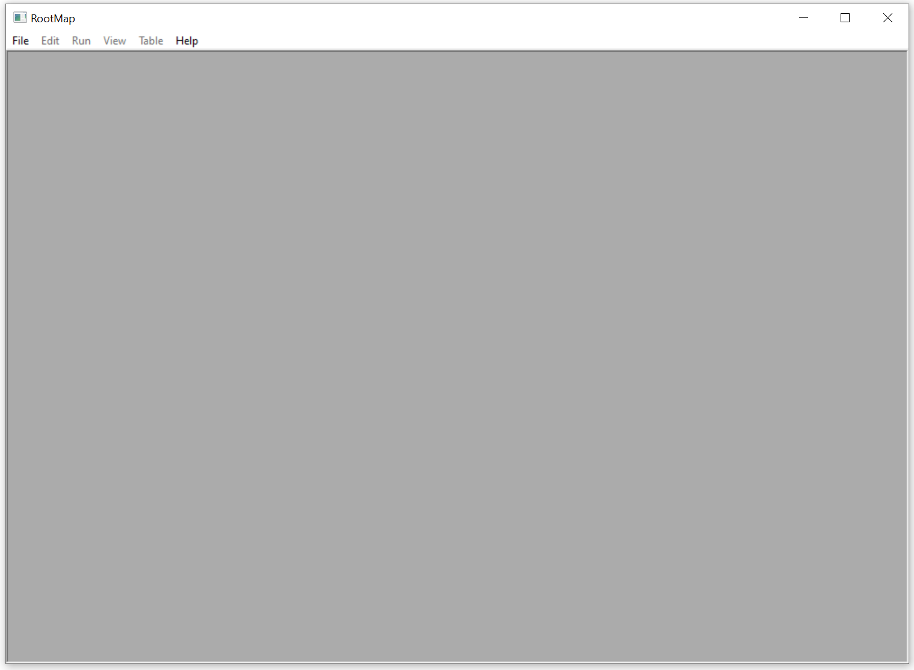
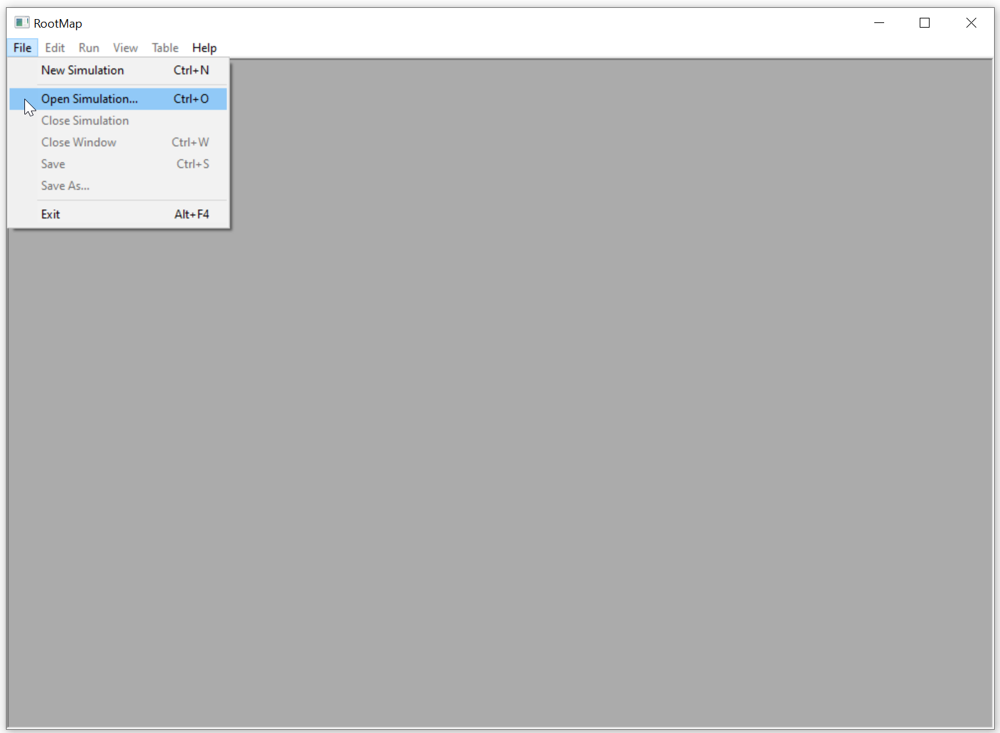
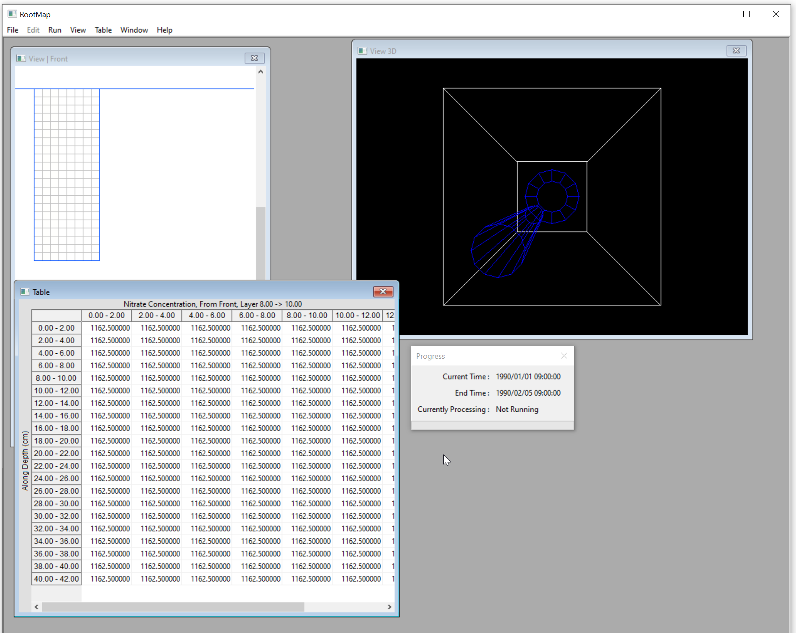
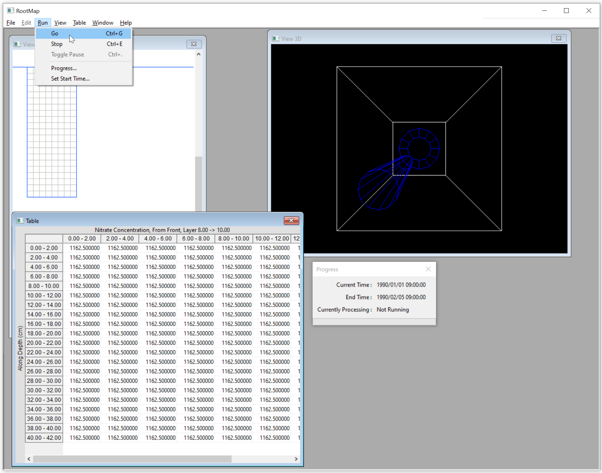
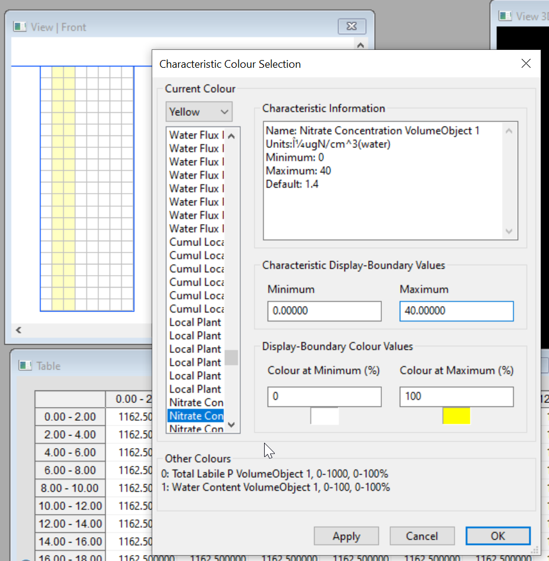
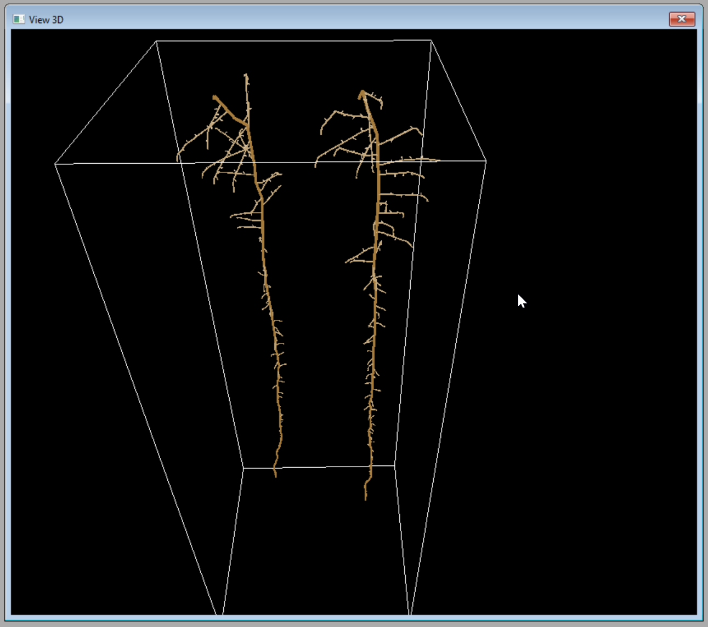

Running your first simulation
=============================

Basic startup
-------------

Launch ROOTMAP via the Start menu or by doubleclicking on the ROOTMAP icon. The main window will open.

To see how ROOTMAP runs, load one of the pre-existing configurations. Click on the **File** menu button, then on **Open Simulation...** as below. (Or you can use the *Ctrl+O* keyboard shortcut.)

A Windows file selection dialog will open to the directory containing the default simulation provided with ROOTMAP. This is a simple simulation that demonstrates most aspects of the model and is an ideal starting point for tweaking model parameters.
A ROOTMAP simulation configuration is a directory made up of around two dozen XML files, some in subdirectories. The file ``rootmap.xml`` is the entry point.
To open the default simulation, simply click **Open** or press Enter.

There are also several other configurations to try out in the Configurations directory.

When the default simulation loads, it will look something like this:

The four display windows shown are the progress window, a tabular view, a 2D front-view and a 3D view. Move these as you prefer for visibility.

Running the simulation and adjusting the view windows
-----------------------------------------------------

To run the simulation you have loaded, click on **Go** from the **Run** menu as in the picture (or use the *Ctrl+G* keyboard shortcut).

The simulation will begin. It may seem to not be doing much for the first few moments, as most configurations are set up for plant growth to begin two days after seeding (time zero).

You can adjust your view of the simulation while it is running, if you wish. Click on the window you wish to select to adjust, then click View. You will get a range of options. These do not change the simulation itself, they only change the display. In the 2D window you will find options for a top view, side view and front view (default is front view). You can also change which soil characteristics are displayed with which colour, as in the example below.

The 3D view is fully navigable with the mouse. You can left-click-and-drag to rotate the model around its central point in space, right-click-and-drag to slide the model around, and use the mousewheel to zoom in and out.

Capturing and viewing output data
---------------------------------

Output files for numeric or raytracing data are defined in the configuration and will always overwrite existing output files. They will remain open for further input until either the simulation has been closed or ROOTMAP has been closed completely. See :doc:`collecting-output` for more details.

Re-running this or another simulation
-------------------------------------

Once the simulation has run through, it can be closed using **Close Simulation** from the **File** menu. You can then re-run the same simulation by re-opening it, or run a new simulation by selecting a new set of configuration files (always by choosing the appropriate ``rootmap.xml`` file via **File** -> **Open Simulation...**).
Some simulations are set to run identically each time, others will be affected by stochastic randomness and produce similar but non-identical results on subsequent runs.
To develop your own configuration for a simulation run, please see the document :doc:`modifying-simulation`.
