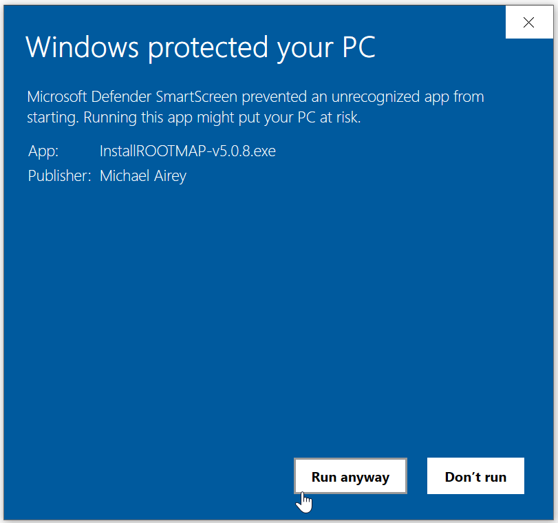

Installation
===================================

ROOTMAP is an application for Windows 10 and 11. Download the latest installer from `<https://rootmapstorageaccount.blob.core.windows.net/rootmap-installers-container/v5.0.8/InstallROOTMAP-v5.0.8.exe>`_.

Run the installer once downloaded and ROOTMAP will install itself and put an icon on the desktop.

The ROOTMAP installer is cryptographically signed by the personal digital certificate of the main developer `Michael Airey <mike.s.airey@gmail.com>`_, meaning you can be sure it has been produced by the legitimate build process from the source code publicly available at `<https://github.com/ROOTMAPSimulationModel>`_.
Despite this, you may find that Windows SmartScreen attempts to block execution of the ROOTMAP installer as an unknown program. If so, click on **More Info** and then **Run anyway** to bypass the warning and continue installation.

Uninstallation
-----------------------------------

To uninstall, locate ROOTMAP in the Windows "Apps and Features" interface (previously known as "Add and Remove Programs") and click Uninstall.
You will be given the option to retain or delete the Configurations, Raytracing and Postprocessing directories in the ROOTMAP installation directory. This option defaults to "retain" to reduce the likelihood of accidental loss of data.
